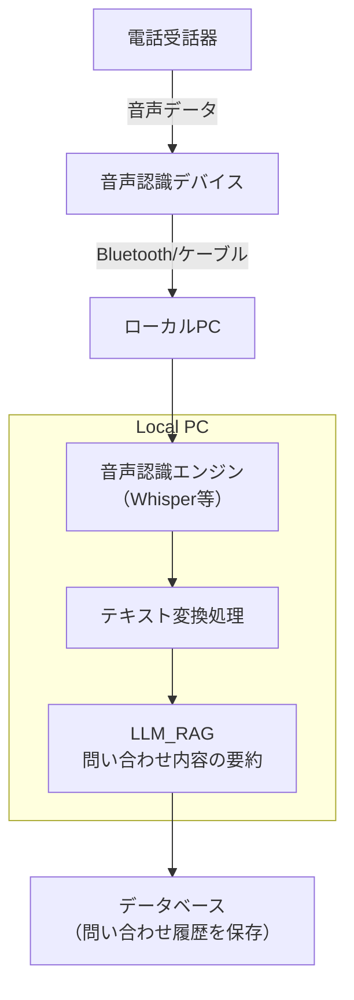

```mermaid
graph TD
    A[電話受話器] -->|音声データ| B[音声認識デバイス]
    B -->|Bluetooth/ケーブル| C[ローカルPC]
    C --> D[音声認識エンジン<br>（Whisper等）]
    D --> E[テキスト変換処理]
    E --> F[LLM_RAG<br> 問い合わせ内容の要約]
    F --> G[データベース<br>（問い合わせ履歴を保存）]

    subgraph Local PC
        D
        E
        F
    end
    
```